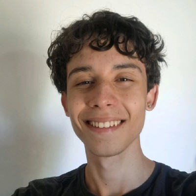

# 🚀 portfolioHUB | Orlando César Nunes de Oliveira

  
  <h1>Engenharia de Software</h1>
  
<i>Desenvolvendo soluções lógicas e explorando os fundamentos da computação</i>

  
  

---

## 1. Perfil Pessoal 👤

**Minha Trajetória e Motivação**
Olá, eu sou o Orlando César. Atualmente, curso o primeiro semestre de Engenharia de Software no **CEUB**, em Brasília. Minha entrada no mundo da programação não foi por acaso; sempre tive uma curiosidade inquieta sobre como sistemas complexos funcionam por baixo do capô. O que me move é a transição do pensamento abstrato para a execução lógica: pegar um problema que parece confuso no papel e transformá-lo em um algoritmo funcional e eficiente.

Não busco apenas "fazer o código rodar". Meu foco está em entender o *porquê* de cada linha. Para mim, programar é uma mistura de engenharia e criatividade. Gosto de documentar meus erros tanto quanto meus acertos, pois acredito que a depuração (o famoso *debugging*) é onde o verdadeiro aprendizado acontece. Sou um entusiasta da automação e estou constantemente explorando como a lógica de programação pode simplificar processos do dia a dia.

**Como me encontrar:**
* 📧 **E-mail:** [orlandocesar.2006nunes@gmail.com](mailto:orlandocesar.2006nunes@gmail.com)
* 📍 **Localização:** Brasília - DF
* 📱 **Telefone:** (61) 98450-3429
* 💼 **LinkedIn:** [Orlando César Nunes de Oliveira](https://www.linkedin.com/in/orlando-cesar-nunes-de-oliveira-5691033b4/)

---

## 2. Currículo 📄

[📥 **Baixe aqui meu currículo completo em PDF**](./curriculo-orlando.pdf)

### 🎯 Objetivo
Estou em busca da minha primeira oportunidade como estagiário em Engenharia de Software. Meu objetivo é aplicar minha base em Python e lógica algorítmica em projetos reais, colaborando com equipes que valorizam a documentação bem feita e o código limpo.

### 🎓 Formação
* **Bacharelado em Engenharia de Software** | CEUB (Brasília)
    * *Início:* 2026 (1° semestre).
    * *Foco acadêmico:* Construção de algoritmos, matemática computacional e fundamentos de hardware/software.
* **Ensino Médio** | Colégio Batista Windermere (Concluído em 2023).

### 🛠️ Hard Skills (Competências Técnicas)
* **Python Avançado (Base):** Domínio de estruturas de decisão (`if/elif/else`), laços de repetição complexos (`while`, `for`, `nested loops`) e manipulação de tipos de dados.
* **Bibliotecas e Ferramentas:** Uso de bibliotecas nativas do Python, IDEs como Thonny e VS Code, e controle de versão com Git/GitHub.
* **Lógica de Codificação:** Entendimento de padrões de transporte de dados (Base64) e manipulação de bytes.

---

## 3. Projetos Acadêmicos e Profissionais 💻

Nesta seção, detalho os problemas que resolvi e o raciocínio técnico que utilizei em cada um.

👉 [🔗 **Veja a documentação detalhada dos códigos aqui**](./projetos_python.pdf)

### 🆕 Projeto Destaque: Codificador e Decodificador Base64
Este foi meu primeiro projeto solo "fora da caixa" da faculdade. Desenvolvi um software para transformar texto comum em padrão Base64 e vice-versa.
* **O que aprendi:** Entendi que o Base64 não é criptografia (senha), mas sim uma **codificação** para garantir que dados viajem pela rede sem corromper. 
* **Técnica utilizada:** Trabalhei com a conversão de strings para bytes (UTF-8), utilizei a biblioteca `base64` do Python e implementei blocos de tratamento de erro para que o programa não trave caso o usuário tente decodificar um código inválido.
* **Ambiente:** Desenvolvido e testado no Thonny.

### Projeto: Engine de Análise de Desempenho Escolar
* **O problema:** Processar notas de uma turma de tamanho desconhecido.
* **A solução:** Implementei um loop `while True` com uma condição de saída (sentinela). O programa calcula médias aritméticas em tempo real usando acumuladores e contadores, separando aprovados de reprovados com base em critérios lógicos predefinidos.

### Projeto: Algoritmo de Filtro e Paridade
* **O problema:** Analisar grandes listas de números e gerar estatísticas separadas.
* **A solução:** Usei o operador de módulo (`%`) para identificar paridade e a função `range()` para criar progressões crescentes e decrescentes. O código é capaz de isolar múltiplos de 3 e calcular médias específicas para grupos de números pares e ímpares simultaneamente.

---

## 4. Habilidades e Competências 🛠️

Abaixo, apresento uma síntese visual das minhas habilidades técnicas e comportamentais. Esta apresentação detalha meu nível de proficiência em cada ferramenta e como aplico meu pensamento analítico nos projetos.

[🎨 **Clique aqui para visualizar meus Slides de Habilidades no Canva**](https://www.canva.com/design/DAHF1Y5vZpM/h_nSjKXd68rTRhDcnz9vPg/view)

---

## 5. Recomendações e Testemunhos 🤝

Atualmente, meu desempenho é validado pelo acompanhamento acadêmico no CEUB:

> *"Orlando destaca-se pela sua capacidade de decompor problemas complexos. Seus projetos em Python mostram um cuidado especial com o tratamento de erros e com a experiência do usuário final no terminal. É um aluno que demonstra maturidade técnica superior para o primeiro semestre, especialmente na compreensão de como os dados são processados e transportados."*
> 
> **— Avaliação de Perfil Acadêmico (CEUB, 2026)**

---

## 6. Outros (Conhecimentos Complementares) 📚

* **Inteligência Artificial (IA):** Estudo de como as IAs podem auxiliar na refatoração de código e automação de testes unitários.
* **Processamento de Imagem:** Noções básicas de como algoritmos manipulam matrizes de pixels para aplicar filtros e correções.
* **Inglês para Desenvolvedores:** Nível intermediário, com foco total em leitura de documentações oficiais (como a do Python.org) e fóruns técnicos (Stack Overflow).

---

  Criado por Orlando César | portfolioHUB • 2026

